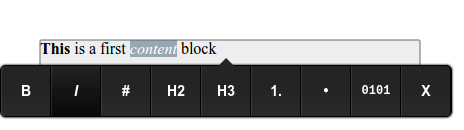

.. _visual:

Визуальный редактор страниц сайта
=================================

Иногда возникает необходимость изменять большое количество
текстовых данных на странице. Если каждый блок данных
представить, как отдельный :term:`атрибут`, то это может перегрузить
:ref:`интерфейс управления содержимым страницы <pmgr>`
и сделает правку страницы неудобной. Также, для многих
пользователей, является более удобным визуальный
способ редактирования контента страницы, когда правки вносятся
прямо в контексте отображаемой в браузере страницы.

В ηCMS есть возможность легко создавать визуально редактируемые
блоки, для этого в разметку нужно добавить
HTML блок (например, `
`) с атрибутом `ncms-block`, значением
которого является уникальный идентификатор блока в контексте страницы.

.. code-block:: html

    

        Содержание блока по умолчанию.
    

После этого, открыв страницу предпросмотра, редактор
сможет редактировать в блоке стилизованный HTML текст с
помощью простого редактора `Medium Editor <https://yabwe.github.io/medium-editor/>`_.

Пример использования
--------------------

Создадим страницу с именем `VisualEditor`, выберем для
нее шаблон с возможностью явно задать :term:`разметку <core>`
в интерфейсе редактирования контента (в странице должен присутствовать
атрибут с типом :ref:`core <am_core>`) и сделаем следующую разметку:

.. code-block:: html

    <html>
      <head>
        <title>${asm('title')}</title>
      </head>
      <body style="width:50%;padding:2em;">
        

            This is a first content block
        

        <footer>
            

              Default footer text
            

        </footer>
      </body>
    </html>

Здесь присутствуют два визуальных блока: с идентификаторами `main` и `footer`,
соответственно. При этом `main` блок выделен серым цветом для наглядности.

Открыв предпросмотр страницы мы получим:

.. image:: img/visual_img1.png

При наведении указателя мыши, визуальный блок будет выделен рамкой.
Кликнув указателем в блок, мы перейдем в режим редактирования
блока, в котором можно менять контент и стилизовать текст:

В результате получаем возможность простого и интуитивного
редактирования блоков страниц ηCMS прямо в интерфейсе предпросмотра:

.. figure:: img/visual_img3.png

    Страница после внесенных изменений

